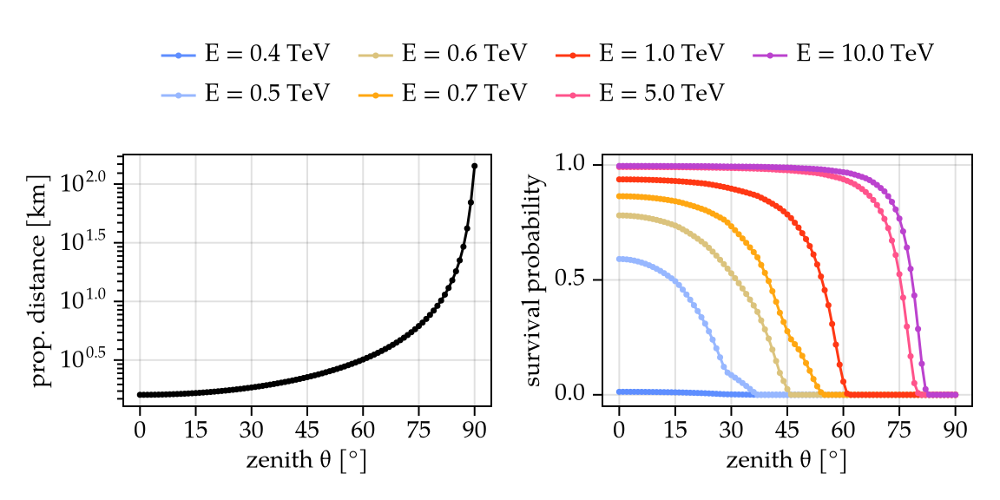
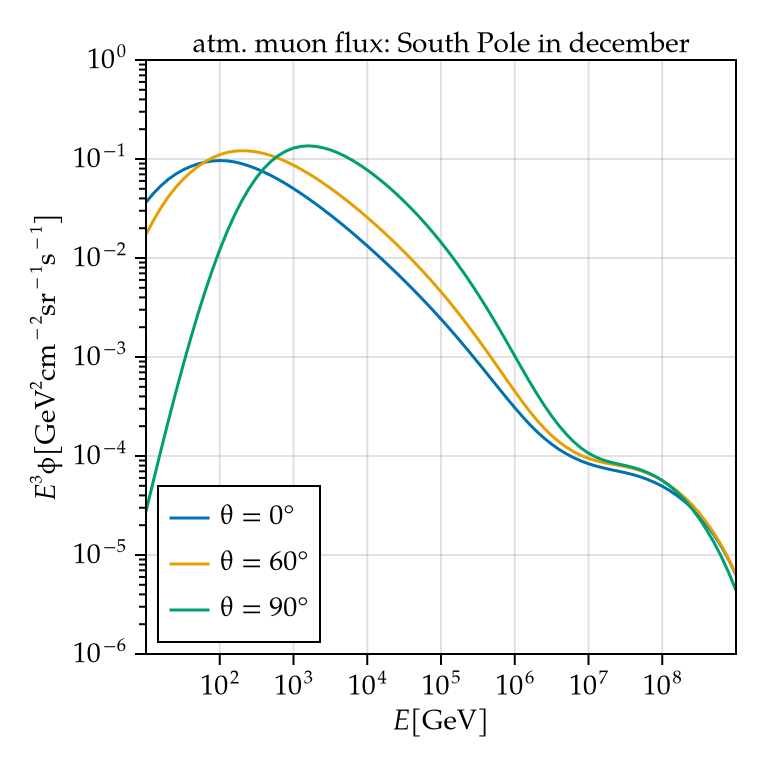

The main calculation result is in `scripts/calc_MTA_rate.jl`.
The current results are:
```
approx. muon rate in IceCube: 2.68 kHz
events / day / MTA: 3.65
```

The survival probability (= probability that a muon reaches a PDOM in the ice with sufficient energy to excite the scintillator) is calculated in `scripts/calc_and_save_P_surv.jl`.

The muon (mu-) fluxes are calculated in `calc_surface_flux.py`

 
